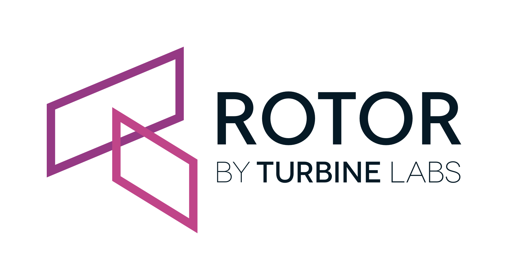

[//]: # ( Copyright 2018 Turbine Labs, Inc.                                   )
[//]: # ( you may not use this file except in compliance with the License.    )
[//]: # ( You may obtain a copy of the License at                             )
[//]: # (                                                                     )
[//]: # (     http://www.apache.org/licenses/LICENSE-2.0                      )
[//]: # (                                                                     )
[//]: # ( Unless required by applicable law or agreed to in writing, software )
[//]: # ( distributed under the License is distributed on an "AS IS" BASIS,   )
[//]: # ( WITHOUT WARRANTIES OR CONDITIONS OF ANY KIND, either express or     )
[//]: # ( implied. See the License for the specific language governing        )
[//]: # ( permissions and limitations under the License.                      )



# turbinelabs/rotor

[](LICENSE)
[](https://godoc.org/github.com/turbinelabs/rotor)
[](https://circleci.com/gh/turbinelabs/rotor)
[](https://goreportcard.com/report/github.com/turbinelabs/rotor)
[](https://codecov.io/gh/turbinelabs/rotor)

Rotor is a fast, lightweight bridge between your service discovery and
[Envoy’s](https://envoyproxy.github.io) configuration APIs. It groups your
infrastructure into Envoy clusters and defines simple routes for each service.
Instances are gathered directly from your service discovery registry, and
clusters are created by grouping together instances under a common tag or label.
This instance and cluster information is served via Envoy’s endpoint and cluster
discovery services, CDS and EDS.

Rotor also sets up Envoy’s routing and listeners (RDS and LDS) to serve
these clusters and send stats to common backends like Prometheus, statsd,
dogstatsd, and Wavefront.

Rotor is a great starting point for quickly integrating Envoy with your
existing environment. It provides a simple service mesh for many applications
out of the box. If you have a more complex application, you can modify it to
your needs or [add an API key](#apikey) to unlock traffic management with
[Houston](https://turbinelabs.io).

## Features

Rotor connects two types of information:

- **Service Discovery** information is collected from your existing registry,
  such as Kubernetes or Consul.
- **Envoy Configuration** is served over Envoy’s discovery services: EDS, CDS,
  RDS, and LDS.
- (optionally) **Configuration via UI and API** is provided by the
  [Turbine Labs](turbinelabs.io) API, with an [API key](#apikey).

Without an API key (“standalone mode”), Rotor will serve Envoy
configuration as follows:

- **Endpoints (EDS)** are mirrored from your service discovery.
- **Clusters (CDS)** are created by grouping endpoints based on labels on your
  nodes/pods/hosts. The label format depends on the service discovery; typically
  `tbn_cluster` or `tbn-cluster`.
- **Routes (RDS)** are created from your clusters. Each cluster is exposed via
  a single domain with the same names as the cluster, and a single catch-all
  route (`/`). This is similar to Consul or Kubernetes DNS discovery for
  service registries.
- **Listeners (LDS)** are statically configured. Rotor configures Envoy
  to listen on port 80 and sets up ALS to collect stats on the routes served
  via RDS.
- **Access Logging (ALS)** is configured, and Rotor can send request
  metrics to Prometheus, statsd, dogstatsd, and/or Wavefront.

With an API key, Rotor acts as the management bastion for
[Houston](https://turbinelabs.io). It provides a highly customizable control
plane for Envoy, including full control over domains, routes, and cluster
behavior. For more information, see the section below on [adding an API
key](#apikey).

## Installation

The simplest way to start using Rotor is to use the docker image. You’ll
need to configure it to point to your service discovery, then configure Envoy to
read xDS configuration from Rotor. How you setup Envoy will depend on your
environment, though you can see a simple example [in the section on Envoy
configuration](#envoy).

Rotor supports the following service discovery integrations:

- Kubernetes
- Consul
- AWS/EC2
- AWS/ECS
- DC/OS
- (experimental) Envoy v1 CDS/SDS
- (experimental) Envoy v2 CDS/EDS

Additionally, Rotor can poll a file for service discovery information. This
provides a lowest-common-denominator interface if you have a mechanism for
service discovery that we don't yet support. We plan to add support for other
common service discovery mechanisms in the future, and we'd
[love your help](http://github.com/turbinelabs/developer/blob/master/README.md#contributing).

**Note**: you must label or tag the instances you want Rotor to collect!
The name of this label is configurable, and the exact configuration option
depends on your service discovery registry. To see the flags available for your
SD, run:

```console
docker run -e "ROTOR_CMD=<platform>" -e "ROTOR_HELP=true" turbinelabs/rotor:0.16.0
```

where `<platform>` is one of: aws, ecs, consul, file, kubernetes, or marathon.

### Kubernetes

Kubernetes requires a number of RBAC objects to be created before running
Rotor. The easiest way to create all these is via
[the YAML file](examples/kubernetes-rotor.yaml) in this repo:

```bash
kubectl create -f https://github.com/turbinelabs/rotor/blob/master/examples/kubernetes-rotor.yaml
```

Labels will be collected from Pods (not Deployments or Services). Add a
`tbn_cluster` label to each Pod Spec with the name of the service you want it
grouped by.

### Consul

Consul requires the datacenter and the host/port of your Consul server.

```console
$ docker run -d \
  -e "ROTOR_CMD=consul" \
  -e "ROTOR_CONSUL_DC=<your datacenter>" \
  -e "ROTOR_CONSUL_HOSTPORT=<consul ip address>:8500" \
turbinelabs/rotor:0.16.0
```

To mark a `Service` for Rotor, add a tag called `tbn-cluster`. See
[examples/consul](examples/consul)for a working example.

### EC2

Rotor can collect labels from the AWS API on EC2 instances.

```console
$ docker run -d \
-e 'ROTOR_AWS_AWS_ACCESS_KEY_ID=<your aws access key>' \
-e 'ROTOR_AWS_AWS_REGION=<your aws region>' \
-e 'ROTOR_AWS_AWS_SECRET_ACCESS_KEY=<your secret access key>' \
-e 'ROTOR_AWS_VPC_ID=<your vpc id>' \
-e 'ROTOR_CMD=aws' \
-p 50000:50000 \
turbinelabs/rotor:0.16.0
```

You need to tag instances with the service name and port it exposes by adding a tag of the format `tbn:cluster:<cluster-name>:<port-name>`. Instances that serve more than one port can be tagged multiple times. For example, to expose two services from a single instance on ports 8080 and 8081, you can tag the instance by running:

```
aws ec2 create-tags \
  --resources <your instance id> \
  --tags \
    Key=tbn:cluster:your-service-name:8080,Value= \
    Key=tbn:cluster:your-other-service:8081,Value=
```

### ECS

ECS integration uses the AWS API, similar to EC2.

```console
$ docker run -d \
-e 'ROTOR_AWS_AWS_ACCESS_KEY_ID=<your aws access key>' \
-e 'ROTOR_AWS_AWS_REGION=<your aws region>' \
-e 'ROTOR_AWS_AWS_SECRET_ACCESS_KEY=<your secret access key>' \
-e 'ROTOR_CMD=ecs \
-p 50000:50000 \
turbinelabs/rotor:0.16.0
```

You can run this inside or outside of ECS itself, as long as your Envoy instances have access to the container on port 50000.

ECS tags indicate the service name and exposed port, and they are located with `dockerLabels` on the container definition:

```json
{
  "dockerLabels": {
    "tbn-cluster": "your-service:8080"
  }
}
```

### DC/OS

Rotor runs as an app inside DC/OS. Save this as `rotor.json`:

```json
{
  "id": "/tbn/rotor",
  "cpus": 1,
  "mem": 128,
  "container": {
    "type": "DOCKER",
    "docker": {
      "image": "turbinelabs/rotor:0.16.0",
      "forcePullImage": true
    }
  },
  "env": {
   "ROTOR_CMD": "marathon",
    "ROTOR_MARATHON_DCOS_ACS_TOKEN": "<your dc/os access token>",
    "ROTOR_MARATHON_DCOS_URL": "<your dc/os admin URL>",
    "ROTOR_MARATHON_DCOS_INSECURE": "<true if admin URL is not HTTPS>"
  },
  "healthChecks": []
}
```

Deploy the app with:

```bash
dcos marathon app add rotor.json
```

To have rotor pick up services, add `tbn_cluster` labels to each container definition with the service name.

### Flat files

Rotor can read from flat files that define clusters and instances.

```console
$ docker run -d \
-e 'ROTOR_CMD=file \
-p 50000:50000 \
turbinelabs/rotor:0.16.0 /path/to/file/in/container
```

The format defines clusters and the associated instances:

```yaml
- cluster: example-cluster-1
  instances:
    - host: 127.0.0.1
      port: 8080
    - host: 127.0.0.1
      port: 8081
- cluster: example-cluster-2
  instances:
    - host: 127.0.0.1
      port: 8083
```

## Envoy

Once Rotor is running, you can configure Envoy to receive EDS, CDS, RDS, and LDS configuration from it. You can put together a bootstrap config based on the [Envoy docs](https://www.envoyproxy.io/docs/envoy/latest/configuration/overview/v2_overview#dynamic), or you can use [envoy-simple](https://github.com/turbinelabs/envoy-simple), a minimal Envoy container that can configured via environment variables.

```console
$ docker run -d \
-e 'ENVOY_XDS_HOST=127.0.0.1' \
-e 'ENVOY_XDS_PORT=50000' \
-p 9999:9999 \
-p 80:80 \
 turbinelabs/envoy-simple:0.16.0
```

You may have to modify the host and port, depending on where you have Rotor deployed.

If you are not using `envoy-simple`, you will have to set
`--service-cluster=default-cluster` and `--service-zone=default-zone` flags on
your Envoy. With a Houston API key, Rotor is capable of serving many different
Envoy configurations, depending on which Envoy is asking. In standalone mode,
all Envoys are assumed to be part of the same Zone and Cluster, so you must make
sure these values are passed to Rotor.  `envoy-simple` passes `default-cluster`
and `default-zone` by default. To serve multiple configs, either run multiple Rotors, fork Rotor and add your own config, or see [Using with Houston](#apikey).

You can verify that Rotor and Envoy are working correctly together by curling the admin interface to Envoy to see the routes that have been set up:

```bash
curl localhost:9999/config_dump
```

If everything is working, you should see a JSON config object with routes for all your services.

## Local Installation / Development

For development, running tests, or custom integration, you may want to run Rotor locally.

### Requirements

- Go 1.10.1 or later (previous versions may work, but we don't build or test against them)

### Dependencies

The `rotor` project depends on these packages:

- [api](https://github.com/turbinelabs/api)
- [cache](https://github.com/turbinelabs/cache)
- [cli](https://github.com/turbinelabs/cli)
- [codec](https://github.com/turbinelabs/codec)
- [nonstdlib](https://github.com/turbinelabs/nonstdlib)
- [stats](https://github.com/turbinelabs/stats)

The tests depend on our [test package](https://github.com/turbinelabs/test),
and on [gomock](https://github.com/golang/mock), and gomock-based Mocks of
most interfaces are provided.

The Rotor plugins depend on many packages, none of which is
exposed in the public interfaces. This should be considered an opaque
implementation detail,
see [Vendoring](http://github.com/turbinelabs/developer/blob/master/README.md#vendoring)
for more discussion.

It should always be safe to use HEAD of all master branches of Turbine Labs
open source projects together, or to vendor them with the same git tag.

### Install

```
go get -u github.com/turbinelabs/rotor/...
go install github.com/turbinelabs/rotor/...
```

### Clone/Test

```
mkdir -p $GOPATH/src/turbinelabs
git clone https://github.com/turbinelabs/rotor.git > $GOPATH/src/turbinelabs/rotor
go test github.com/turbinelabs/rotor/...
```

## Godoc

[Rotor](https://godoc.org/github.com/turbinelabs/rotor)

## Versioning

Please see [Versioning of Turbine Labs Open Source Projects](http://github.com/turbinelabs/developer/blob/master/README.md#versioning).

## Pull Requests

Patches accepted! In particular we'd love to support other mechanisms of
service discovery. Please see
[Contributing to Turbine Labs Open Source Projects](http://github.com/turbinelabs/developer/blob/master/README.md#contributing).

<a name=”apikey”></a>
## API Key

Rotor is also a part of a paid subscription to [Houston](https://turbinelabs.io). By adding an API key to Rotor, you unlock traffic management for your whole team, including:

- An easy-to-use UI for creating and modifying routes
- Full configuration of all of Envoy’s features: advanced load balancing, health checking, circuit breakers, and more
- Automatic collection of Envoy’s metrics for routes, clusters, and more, with easy integration into statsd, Prometheus, and other common dashboards

Specifically, instead of the static routes described in [Features](#features), an API key allows more flexible configuration of routes, domains, listeners, and clusters through Houston. You can also run multiple Rotor processes to bridge, e.g. EC2 and Kubernetes, allowing you configure routes that incrementally migrate traffic from one to the other. Houston also collects all the additional metadata on your instances, allowing you to route traffic based on custom tags and labels.

If you already have an API key, see the [Turbine Labs docs]](http://docs.turbinelabs.io/) for how to get started.

## Code of Conduct

All Turbine Labs open-sourced projects are released with a
[Contributor Code of Conduct](CODE_OF_CONDUCT.md). By participating in our
projects you agree to abide by its terms, which will be carefully enforced.
